# 目 录

# 引言.. 1

（一） 编写目的...  
（二） 定义...  
（三） 参考资料..

# 程序系统的结构.. 2

（一） 系统总图...  
（二） 在线业务... 2  
（三） 业务台帐... 3

# 三、 数据字典.. 3

# 四、 新建地价模块设计说明. 3

（一） 程序描述.. 3  
（二） 功能...  
（三） 输入项... 4  
（四） 输出项..   
（五） 流程逻辑.. 4  
（六） 接口...

# 五、 编辑地价业务. 9

（一） 程序描述.. 9  
（二） 功能... 9  
（三） 输入项... ..10  
（四） 输出项.. ..10  
（五） 流程逻辑.. ..11  
（六） 接口... .12

# 六、 红线上传设计说明. .14

（一） 程序描述.. .14  
（二） 功能... ..14  
（三） 输入项... .15  
（四） 输出项.. .15  
（五） 流程逻辑. .15  
（六） 接口.... ...16

# 1． 上传红线.. .16

# 七、 地价列表.. .16

（一） 程序描述.. .16  
（二） 功能... .17  
（三） 输入项... .17  
（四） 输出项.. ...18  
（五） 流程逻辑.. .18  
（六） 接口... .19

# 八、 地价数据导入模板下载. .21

（一） 程序描述. ..21  
（二） 功能.... ..21  
（三） 输入项... ...21

（四） 输出项.. ..22  
（五） 流程逻辑.. .22  
（六） 接口... ..23

# 九、 地价数据导入. .23

（一） 程序描述.. ..23  
（二） 功能... ..24  
（三） 输入项... ..24  
（四） 输出项.. ..25  
（五） 流程逻辑.. ..25  
（六） 接口... ..26

# 一、引言

# （一）编写目的

本文档为《三水区地价管理信息系统》概要设计说明书，对该系统的层次划分、模块功能、数据结构、接口、出错处理和扩展性进行设计，目的是让软件开发人员根据本文档的内容进行程序开发，使设计的产品符合用户的需求，同时为测试人员提供参考。

# （二）定义

《三水区地价管理信息系统》是整合各类国土房管资源数据的基础上，利用GIS 技术、数据库管理技术、软件开发技术等，建立专业、便捷、规范的土地综合数据管理系统，实现对国土资源核心数据的分层叠加与分析、查询与浏览、共享与交换、数据更新与历史管理，全方位服务于土地的各个业务环节，为管理决策部门提供科学的、准确的数据分析和决策支持。

# （三）参考资料

三水区地价管理信息系统软件需求规格说明书

# 二、程序系统的结构

# （一）系统总图

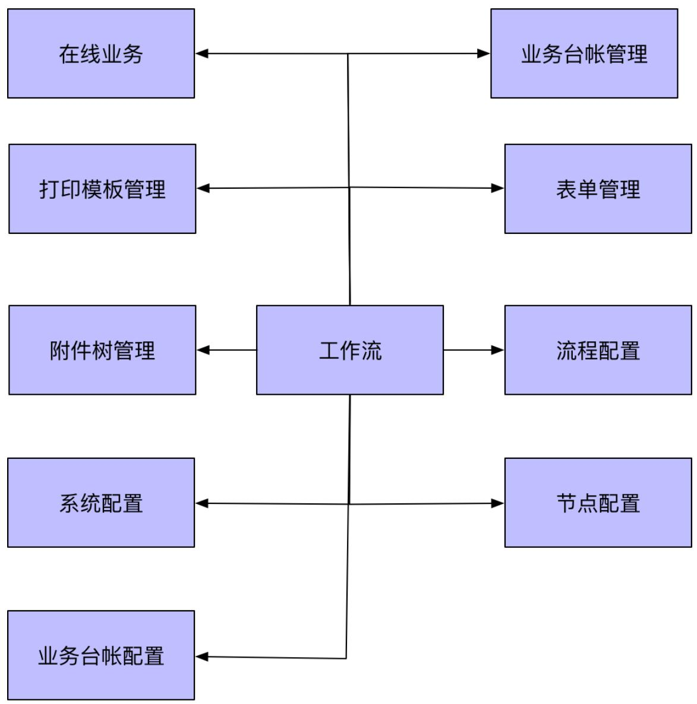  
图 2-1 系统总图

# （二）在线业务

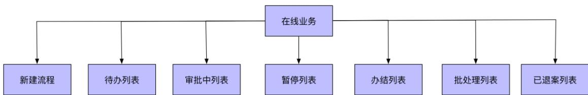

图 2-2 在线业务

# （三）业务台帐

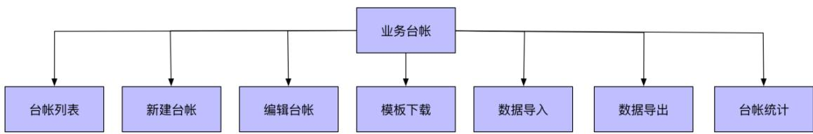  
图 2-3 业务台帐

# 三、数据字典

参见三水区地价管理信息系统建设采购项目数据库设计说明书。

# 四、新建地价模块设计说明

# （一）程序描述

标定地价列表点击“新建”按钮 ，弹出新建地价界面。界面左侧由上而下显示台帐绑定的表单、台帐附件目录、台帐模板目录。点击左侧表单可进行表单切换，切换表单后表单中填写的数据会自动保存到数据库中，也可点击“保存”按钮手动进行保存。

# （二）功能

点击新建按钮，显示台帐新建界面。界面显示：

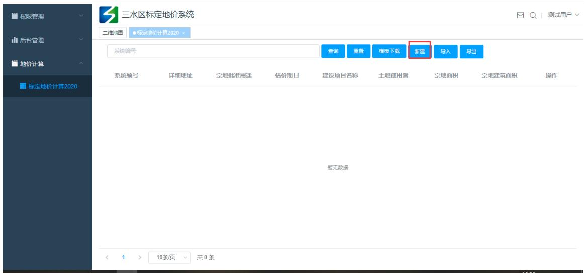

  
图 5-2-1 新建台帐界面  
图 5-2-2 新建台帐 IPO 图

# （三）输入项

表单配置的各字段数据。

# （四）输出项

无

# （五）流程逻辑

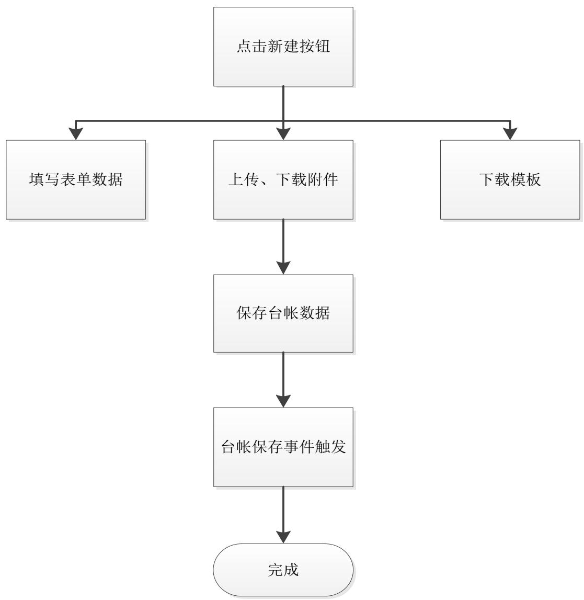  
图5-2-3 新建台帐流程逻辑

# （六）接口

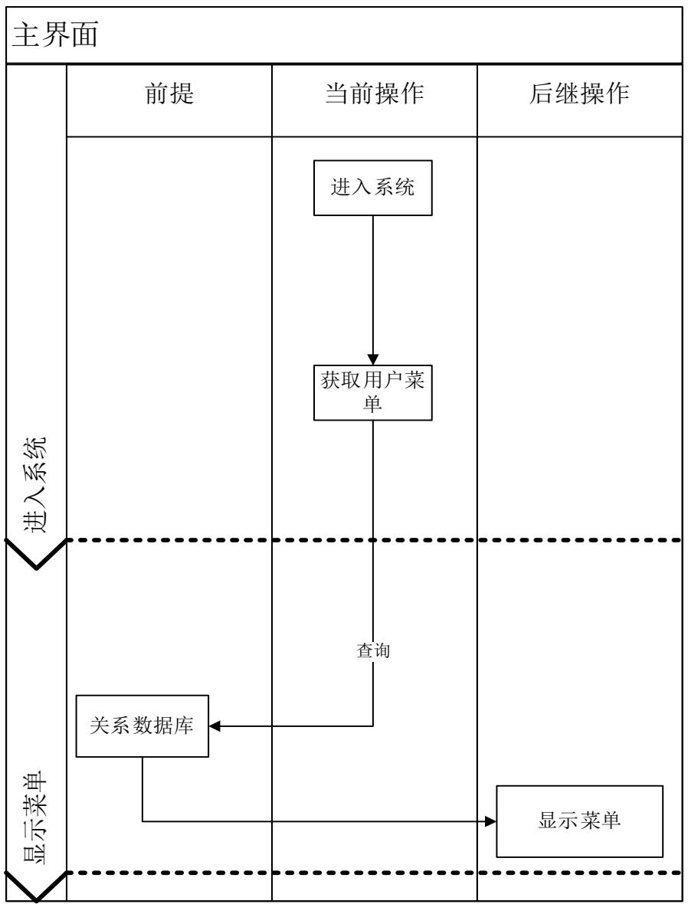

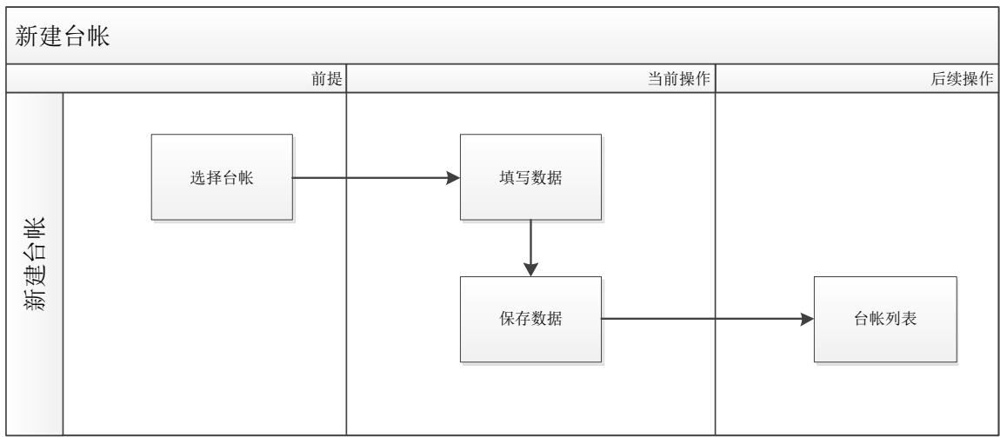  
图 5-6-1 主界面说明

图 5-6-1 新建台帐

# 1．获取绑定按钮列表

接口类名称：LedgerController；

接口方法：

<table><tr><td>名称与描述</td><td>返回类型</td><td>参数类型</td><td>参数描述</td></tr><tr><td>buttonList: 获取绑定按钮列表</td><td>ResultInfo</td><td>String</td><td>台帐名称</td></tr></table>

# 2．根据台帐名称获取附件树

接口类名称：LedgerFileController；

接口方法：

<table><tr><td>名称与描述</td><td>返回类型</td><td>参数类型</td><td>参数描述</td></tr><tr><td>getFileTree: 根据台帐名称获取附件树</td><td>ResultInfo</td><td>String</td><td>台帐名称</td></tr></table>

# 3．根据地价信息获取模板树

接口类名称：LedgerTemplateController；

接口方法：

<table><tr><td>名称与描述</td><td>返回类型</td><td>参数类型</td><td>参数描述</td></tr><tr><td>getTreeInfo: 根据地 价信息获取模板树</td><td>ResultSet</td><td>String</td><td>台帐名称</td></tr></table>

# 4．获取表单树以及目录

接口类名称：LedgerController；

接口方法：

<table><tr><td>名称与描述</td><td>返回类型</td><td>参数类型</td><td>参数描述</td></tr><tr><td>getFormCoreTree: 获取表单树以及目录</td><td>ResultSet</td><td>String</td><td>台帐名称</td></tr></table>

# 5．获取表单验证规则

接口类名称：LedgerController；

接口方法：

<table><tr><td>名称与描述</td><td>返回类型</td><td>参数类型</td><td>参数描述</td></tr><tr><td rowspan="2">getTaskFormValidRule:获取表单验证规则</td><td rowspan="2">ResultInfo</td><td>String</td><td>台帐名称</td></tr><tr><td>String</td><td>表单KEY</td></tr></table>

# 6．获取表单

接口类名称：FormCoreController；

接口方法：

<table><tr><td>名称与描述</td><td>返回类型</td><td>参数类型</td><td>参数描述</td></tr><tr><td rowspan="2">getTaskForm: 获取表单</td><td rowspan="2">ResultSet</td><td>Integer</td><td>表单版本</td></tr><tr><td>String</td><td>表单KEY</td></tr></table>

# 7．根据业务编号查询台帐业务数据

接口类名称：LedgerController；

接口方法：

<table><tr><td>名称与描述</td><td>返回类型</td><td>参数类型</td><td>参数描述</td></tr><tr><td rowspan="3">get: 根据业务编号查询
出台帐业务数据</td><td rowspan="3">ResultInfo</td><td>String</td><td>台帐名称</td></tr><tr><td>String</td><td>表单KEY</td></tr><tr><td>String</td><td>业务编号</td></tr></table>

# 五、编辑地价业务

# （一）程序描述

点击地价列表“编辑”按钮，弹出台帐编辑界面。新建台帐时填写的表单数据、上传的附件文件也会回显到界面中。界面左侧由上而下显示台帐绑定的表单、台帐附件目录、台帐模板目录。点击左侧表单可进行表单切换，切换表单后表单中填写的数据会自动保存到数据库中，也可点击“保存”按钮手动进行保存。

# （二）功能

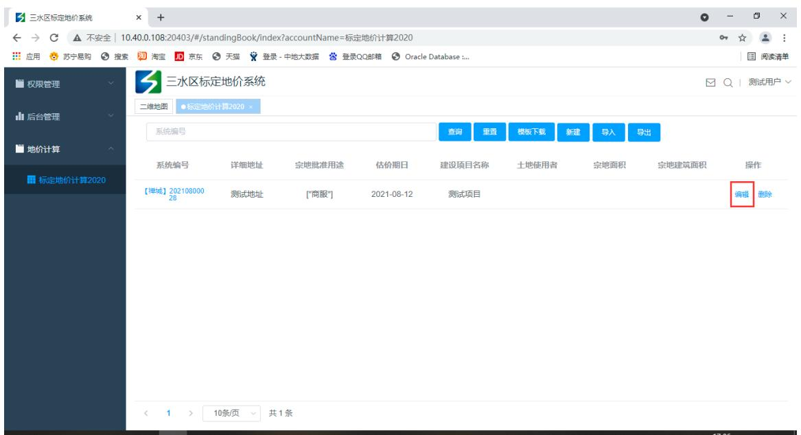  
台帐编辑界面：

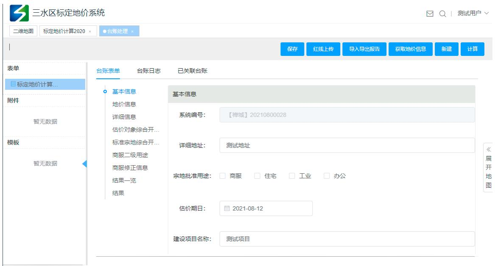  
图 6-2-1 台帐编辑界面

  
图 6-2-4 编辑台帐 IPO 图

# （三）输入项

表单配置的各字段数据。

# （四）输出项

无

# （五）流程逻辑

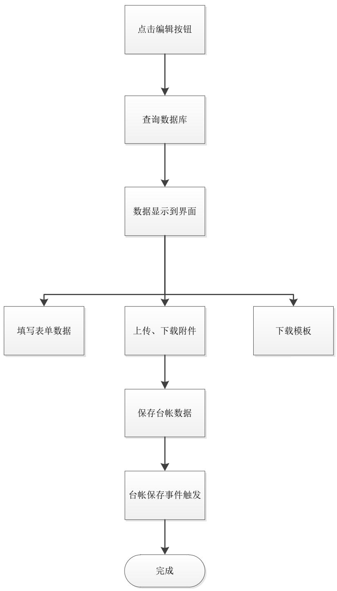  
图 6-5-1 编辑台帐流程逻辑

# （六）接口

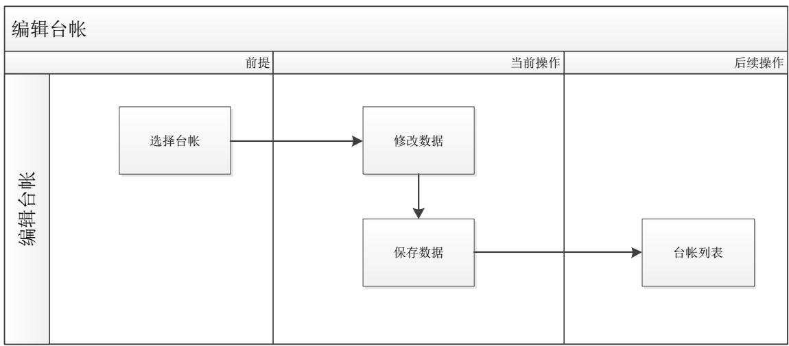  
图 6-6-1 编辑台帐

# 1．获取绑定按钮列表

接口类名称：LedgerController；

接口方法：

<table><tr><td>名称与描述</td><td>返回类型</td><td>参数类型</td><td>参数描述</td></tr><tr><td>buttonList: 获取绑定按钮列表</td><td>ResultInfo</td><td>String</td><td>台帐名称</td></tr></table>

# 2．根据台帐名称获取附件树

接口类名称：LedgerFileController；

接口方法：

<table><tr><td>名称与描述</td><td>返回类型</td><td>参数类型</td><td>参数描述</td></tr><tr><td>getFileTree: 根据台帐名称获取附件树</td><td>ResultInfo</td><td>String</td><td>台帐名称</td></tr></table>

# 3．根据地价信息获取模板树

接口类名称：LedgerTemplateController；

接口方法：

<table><tr><td>名称与描述</td><td>返回类型</td><td>参数类型</td><td>参数描述</td></tr><tr><td>getTreeInfo: 根据地 价信息获取模板树</td><td>ResultSet</td><td>String</td><td>台帐名称</td></tr></table>

# 4．获取表单树以及目录

接口类名称：LedgerController；

接口方法：

<table><tr><td>名称与描述</td><td>返回类型</td><td>参数类型</td><td>参数描述</td></tr><tr><td>getFormCoreTree: 获取表单树以及目录</td><td>ResultSet</td><td>String</td><td>台帐名称</td></tr></table>

# 5．获取表单验证规则

接口类名称：LedgerController；

接口方法：

<table><tr><td>名称与描述</td><td>返回类型</td><td>参数类型</td><td>参数描述</td></tr><tr><td rowspan="2">getTaskFormValidRule:获取表单验证规则</td><td rowspan="2">ResultInfo</td><td>String</td><td>台帐名称</td></tr><tr><td>String</td><td>表单KEY</td></tr></table>

# 6．获取表单

接口类名称：FormCoreController；

接口方法：

<table><tr><td>名称与描述</td><td>返回类型</td><td>参数类型</td><td>参数描述</td></tr><tr><td rowspan="2">getTaskForm: 获取表单</td><td rowspan="2">ResultSet</td><td>Integer</td><td>表单版本</td></tr><tr><td>String</td><td>表单KEY</td></tr></table>

# 7．根据业务编号查询台帐业务数据

接口类名称：LedgerController；

接口方法：  

<table><tr><td>名称与描述</td><td>返回类型</td><td>参数类型</td><td>参数描述</td></tr><tr><td rowspan="3">get: 根据业务编号查询
出台帐业务数据</td><td rowspan="3">ResultInfo</td><td>String</td><td>台帐名称</td></tr><tr><td>String</td><td>表单KEY</td></tr><tr><td>String</td><td>业务编号</td></tr></table>

# 六、红线上传设计说明

# （一）程序描述

用于直接使用红线文件上传红线示例。

# （二）功能

打开流程示例，点击红线上传按钮，弹出上传文件选择窗口，选择红线文件上传。

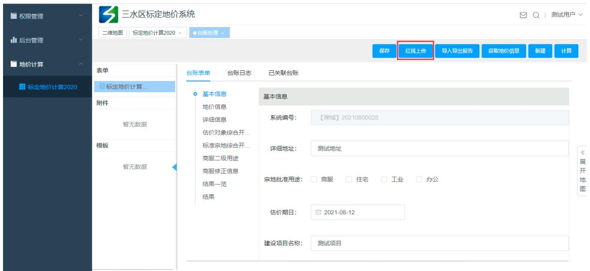

  
红线上传 IPO图

# （三）输入项

红线文件

# （四）输出项

无

# （五）流程逻辑

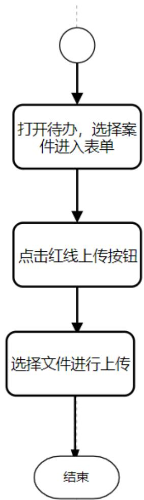

红线上传流程逻辑图

# （六）接口

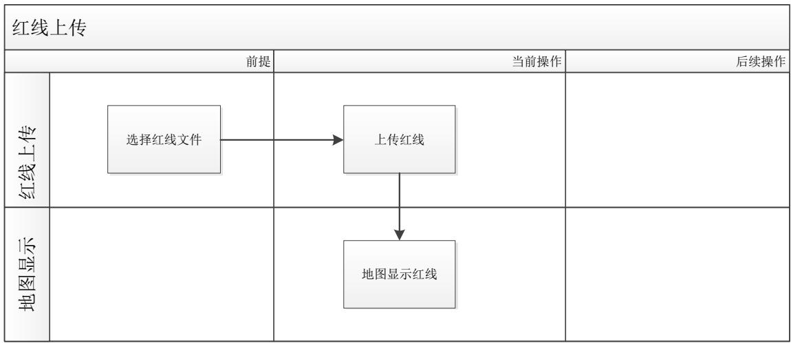

# 1．上传红线

接口类名称：LedgerRedLineInstanceController；

接口方法：

<table><tr><td>名称与描述</td><td>返回类型</td><td>参数类型</td><td>参数描述</td></tr><tr><td rowspan="2">uploadRedLine: 上传红线</td><td rowspan="2">ResultInfo</td><td>String</td><td>地块号</td></tr><tr><td>File</td><td>红线文件</td></tr></table>

# 七、地价列表

# （一）程序描述

地价台帐字段信息以列表形式展示，上方显示搜索条件文本框。可输入需要搜索的文字进行模糊搜索，如需更多条件搜索，可点击搜索框右侧的展示按钮，展开更多搜索条件进行数据搜索。

# （二）功能

业务台帐列表界面，界面如下：

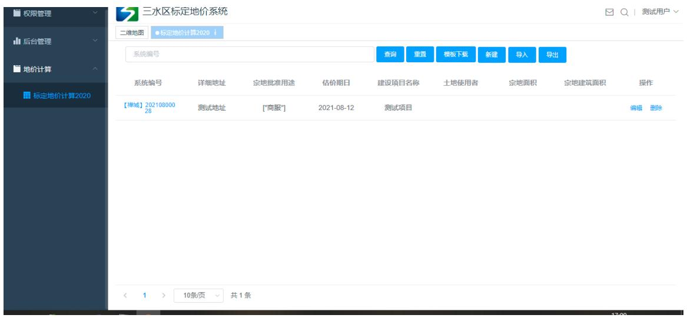  
图 8-2-1 台帐列表界面

输入查询内容 ，系统查询出数据并加载到界面中。

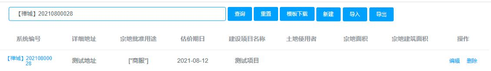  
图 8-2-2 台帐列表搜索界面

  
图 8-2-3 台帐列表 IPO 图

# （三）输入项

无

# （四）输出项

打开台帐列表后，显示列表字段数据。

# （五）流程逻辑

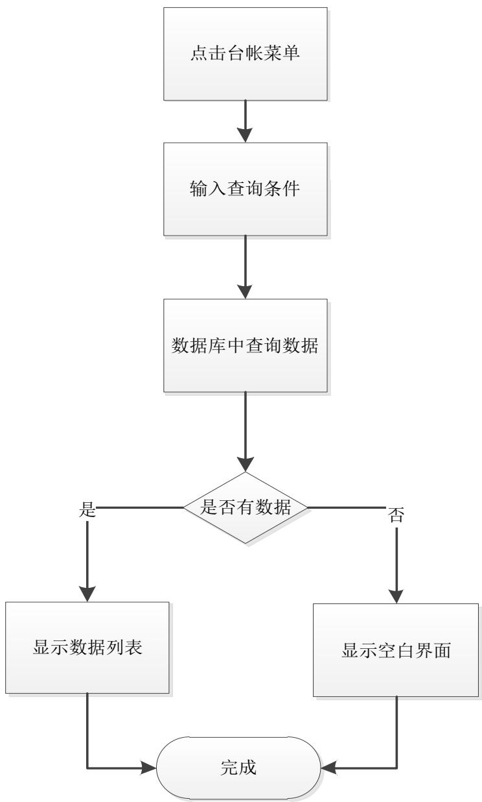  
图8-5-1 台帐列表流程逻辑

# （六）接口

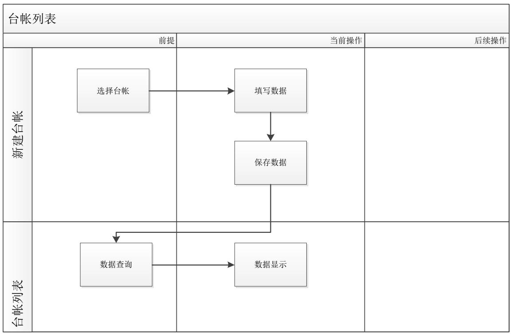  
图 8-6-1 台帐列表

# 1.获取地价显示配置

接口类名称：LedgerController；

接口方法：

<table><tr><td>名称与描述</td><td>返回类型</td><td>参数类型</td><td>参数描述</td></tr><tr><td>getPageShowConfig: 获取地价显示配置</td><td>ResultSet</td><td>String</td><td>台帐名称</td></tr></table>

# 2.地价高级查询查询接口

接口类名称：LedgerSearchConfigController；

接口方法：

<table><tr><td>名称与描述</td><td>返回类型</td><td>参数类型</td><td>参数描述</td></tr><tr><td>list: 地价高级查询查询接口</td><td>ResultInfo</td><td>String</td><td>台帐名称</td></tr></table>

# 3．获取台帐列表表头

接口类名称：LedgerController；

接口方法：

<table><tr><td>名称与描述</td><td>返回类型</td><td>参数类型</td><td>参数描述</td></tr><tr><td>getTodoTitle: 获取台帐列表表头</td><td>ResultInfo</td><td>String</td><td>台帐名称</td></tr></table>

# 4．获取业务台帐列表数据接口

接口类名称：LedgerController；

接口方法：

<table><tr><td>名称与描述</td><td>返回类型</td><td>参数类型</td><td>参数描述</td></tr><tr><td rowspan="3">list: 获取业务台帐列表数据接口</td><td rowspan="3">ResultInfo</td><td>String</td><td>台帐名称</td></tr><tr><td>Integer</td><td>当前页数</td></tr><tr><td>Integer</td><td>每页数量</td></tr></table>

# 八、地价数据导入模板下载

# （一）程序描述

点击台帐菜单，进入到业务台帐列表界面。点击“模板下载”按钮 ，数据导入模板会自动下载到本地电脑。

# （二）功能

  
图 9-2-1 数据导入模板下载IPO图

# （三）输入项

无

# （四）输出项

下载数据导入模板文件。

# （五）流程逻辑

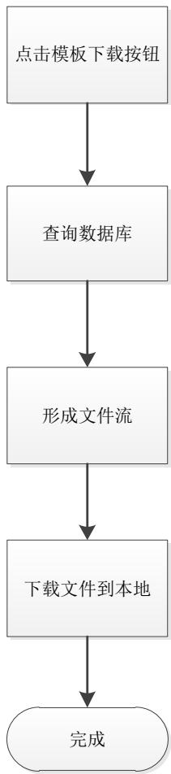  
图9-5-1 数据导入模板下载流程逻辑

# （六）接口

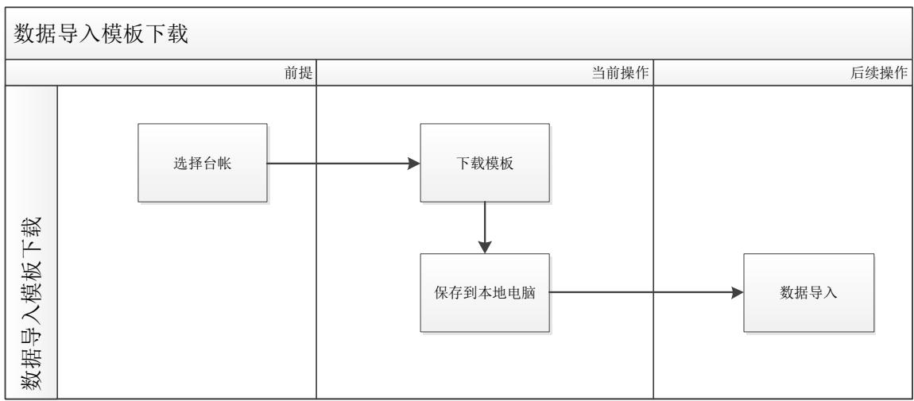  
图 9-6-1 数据导入模板下载

# 1．导出地价数据导入模板

接口类名称：LedgerController；

接口方法：

<table><tr><td>名称与描述</td><td>返回类型</td><td>参数类型</td><td>参数描述</td></tr><tr><td>exportLedgerTemplate: 
导出地价数据导入模板</td><td>ResultInfo</td><td>String</td><td>台帐名称</td></tr></table>

# 九、地价数据导入

# （一）程序描述

先将数据导入模板下载本地，并将数据填写到模板中。点击“导入”按钮 ，选择模板文件，点击确定即完成数据导入操作。数据导入完成后列表会显示出导入的数据。

# （二）功能

台帐数据导入界面：

  
图 10-2-1 数据导入界面

选择模板文件界面：

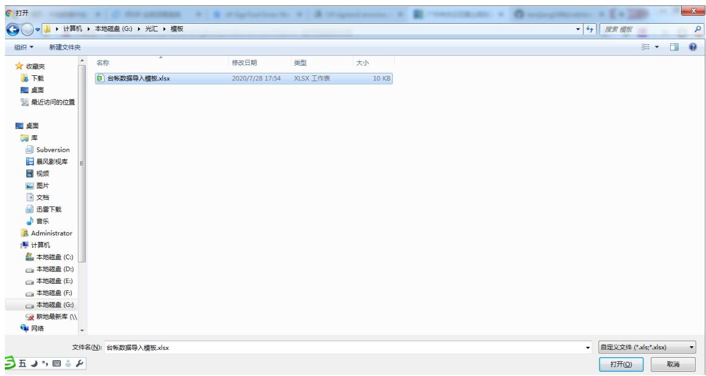

  
图10-2-2 选择模板文件界面  
图 10-2-2 数据导入 IPO 图

# （三）输入项

<table><tr><td>名称</td><td>数据的类型</td><td>有效范围</td><td>输入的方式</td></tr><tr><td>选择数据导入模板</td><td></td><td></td><td>鼠标人工选择</td></tr></table>

# （四）输出项

列表加载出导入的数据。

# （五）流程逻辑

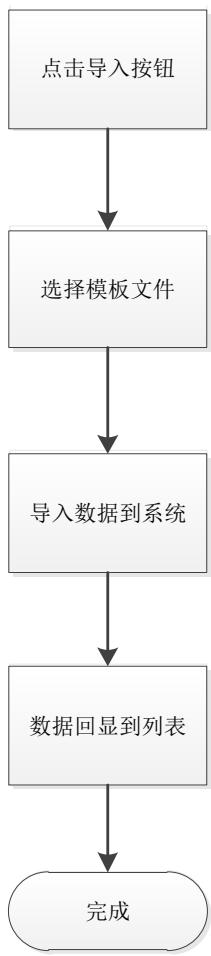  
图 10-5-1 台帐数据导入流程逻辑

# （六）接口

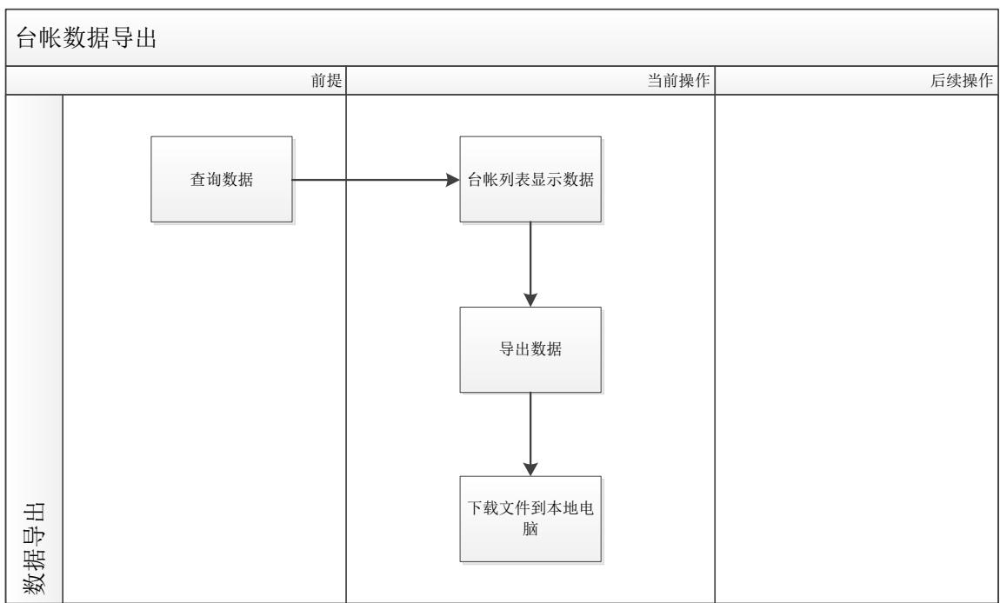  
图 10-6-1 数据导出

# 1．导出地价信息

接口类名称：LedgerController；

接口方法：

<table><tr><td>名称与描述</td><td>返回类型</td><td>参数类型</td><td>参数描述</td></tr><tr><td>export: 导出地价信息</td><td>ResultInfo</td><td>String</td><td>台帐名称</td></tr></table>